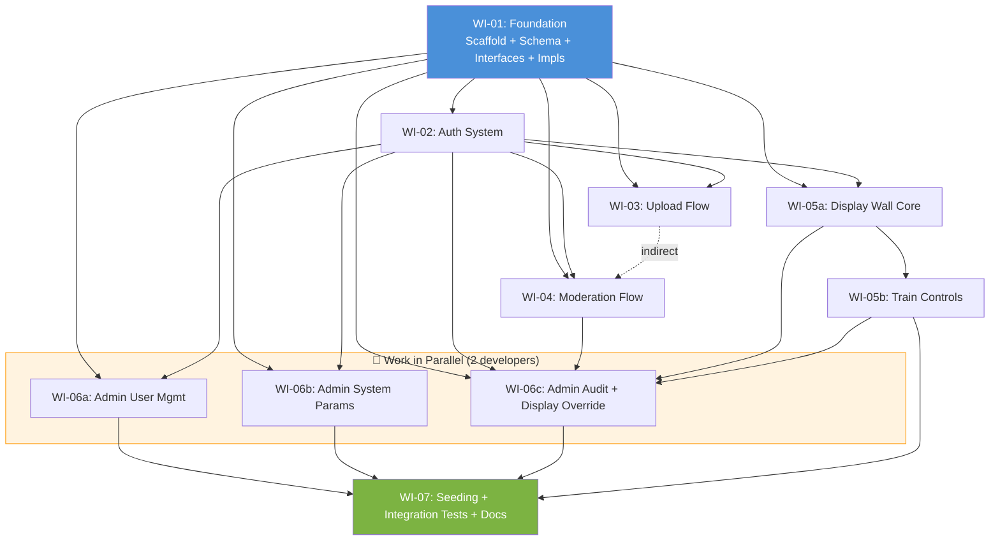

# Epic Plan — Phase 01: MVP Local Development

> **Project**: ground-up-wall — National Day Community Party Photowall  
> **Phase**: 01 — Local Deno Application (MVP)  
> **Target Environment**: Local development (Deno + Postgres + filesystem)  
> **Author**: Epic Planning Roundtable (Mary 📊, Winston 🏗️, Amelia 💻, Murat 🧪)  
> **Date**: 2026-06-06

---

## Table of Contents

1. [Executive Summary](#1-executive-summary)
2. [Architecture Overview](#2-architecture-overview)
3. [Work Items — Dependency Diagram](#3-work-items--dependency-diagram)
4. [Work Items — Table](#4-work-items--table)
5. [Development Workflow](#5-development-workflow)
6. [Exit Criteria](#6-exit-criteria)
7. [Risk Register](#7-risk-register)

---

## 1. Executive Summary

Phase 01 delivers a fully functional photowall system running entirely on localhost — Deno Fresh + local Postgres + filesystem storage. All features from Requirements Update 01 and Update 02 are included: photo upload (with configurable message length, privacy acknowledgment, auto-moderator flagging), moderation (approve/reject/edit/delete with audit trail), display wall (SMRT MRT train animation with pause/play/jump controls, auth-gated access, display override for blank/placeholder/resume), admin panels (user management for Moderators and Display Wall accounts, system parameters, audit log), and password management.

The architecture follows an **interface-based abstraction pattern** — Repository, StorageService, RealtimeService, AuditService, and AutoModeratorService are defined as interfaces with local-only implementations in Phase 01. This ensures Phase 02 (cloud deployment to Deno Deploy + Supabase) requires only new implementations of the same interfaces with zero business logic changes.

**Total work items**: 10  
**Estimated effort**: ~25–30 hours implementation + ~8 hours testing  
**Parallel work capacity**: 2 developers (Items WI-06a, WI-06b, WI-06c can be developed concurrently)  
**Delivery**: Each work item produces a feature-branch PR that is reviewed and merged to `main`

---

## 2. Architecture Overview

### 2.1 System Architecture (3-Layer)

```
┌────────────────────────────────────────────────────────────────────────────┐
│                         PRESENTATION LAYER                                 │
├─────────────┬─────────────┬──────────────┬────────────┬─────────┬──────────┤
│    Upload   │   Display   │  Moderation  │   Admin    │  Auth   │  Audit   │
│  Component  │  Component  │  Component   │  Component │Component│  (Admin  │
│             │             │              │            │         │   View)  │
└──────┬──────┴──────┬──────┴──────┬───────┴──────┬─────┴────┬────┴─────────┘
       │             │             │              │          │
       └─────────────┴─────────────┴──────────────┴──────────┘
                              │
                              ▼
┌────────────────────────────────────────────────────────────────────────────┐
│                         SERVICE LAYER (Facade)                             │
│                          PhotoWallService                                  │
├────────────────────────────────────────────────────────────────────────────┤
│  ┌──────────┐  ┌────────────┐  ┌──────────────┐  ┌──────────┐ ┌─────────┐ │
│  │Repository│  │  Storage   │  │   Realtime   │  │  Audit   │ │Automod- │ │
│  │ (Data)   │  │  Service   │  │   Service    │  │  Service │ │erator   │ │
│  │          │  │  (Images)  │  │   (Events)   │  │  (Log)   │ │Service  │ │
│  └────┬─────┘  └────┬───────┘  └──────┬───────┘  └────┬─────┘ └─────────┘ │
└───────┼─────────────┼─────────────────┼───────────────┼───────────────────┘
        │             │                 │               │
        ▼             ▼                 ▼               ▼
┌────────────────────────────────────────────────────────────────────────────┐
│                         INFRASTRUCTURE LAYER                               │
├────────────────────────────────────────────────────────────────────────────┤
│  Local: Postgres + Filesystem           │  Phase 2: Supabase              │
│  (PostgresRepository,                   │  (SupabaseRepository,            │
│   FileStorageService,                   │   SupabaseStorageService,        │
│   MemoryRealtimeService)                │   SupabaseRealtimeService)       │
└────────────────────────────────────────────────────────────────────────────┘
```

### 2.2 Database Schema (4 Tables)

| Table | Purpose | Key Columns |
|-------|---------|-------------|
| `submissions` | Photo submissions lifecycle | id, image_url, message, submitter_name, social_handle, status (pending/approved/rejected), source, flagged_words, is_flagged, edited_by, edit_count, timestamps |
| `users` | All authenticated accounts | id, username, password_hash, role (admin/moderator/display_wall), disabled, timestamps |
| `audit_log` | Append-only action log | id, moderator_id, action_type, target_type, target_id, old_value, new_value, timestamp |
| `system_config` | Configurable parameters | key (PK), value, default_value, updated_at, updated_by |

### 2.3 Key Architectural Decisions

| Decision | Rationale |
|----------|-----------|
| PhotoWallService as a single facade | Small project — one coordinating service simplifies development |
| Interface-based infrastructure layers | Enables Phase 2 (cloud) with zero business logic changes |
| Circular doubly-linked chain for train | O(1) cabin lookup, smooth chain-relinking for jump-to-cabin |
| SSE for local real-time | Simple, no WebSocket dependency in Phase 1; falls back to polling |
| In-memory event emitter for Realtime | Works within single Deno process; Supabase Realtime in Phase 2 |
| Client-side image compression | Reduces storage requirements, stays within Supabase free-tier limits |

---

## 3. Work Items — Dependency Diagram



### 3.1 Recommended Development Sequence

```
Week 1                          Week 2                          Week 3
├── WI-01 ── WI-02 ── WI-03 ── WI-04 ── WI-05a ── WI-05b ── WI-06a ─┐
                                            └── WI-06b (parallel) ──┤── WI-07
                                            └── WI-06c (parallel) ──┘

Sequential:   WI-01 → WI-02 → WI-03 → WI-04 → WI-05a → WI-05b
Parallel:     WI-06a (Dev 1) + WI-06b (Dev 2) + WI-06c (either, after WI-04 + WI-05a done)
Capstone:     WI-07 (both developers contribute)
```

---

## 4. Work Items — Table

| ID | Name | Description | Status | Assigned To | Dependencies | Comments |
|---|:----:|-------------|:------:|:-----------:|:------------:|----------|
| **WI-01** | **Foundation** | Project scaffold (Deno Fresh), Postgres schema for all 4 tables, Repository/StorageService/RealtimeService/AuditService/AutoModeratorService interface definitions, PostgresRepository/FileStorageService/MemoryRealtimeService local implementations, dependency injection wiring, contract tests for all interfaces. [📄 Code Execution Plan](code_execution_plan-wi-01.md) | Closed | LihWei | — | Foundation for everything. Amelia suggests merging schema + interfaces + impls into one WI — they're too tightly coupled to split. Murat flags: contract tests here are critical for Phase 2. |
| **WI-02** | **Auth System** | AuthComponent, login/logout routes, session management (cookie/token), role-based access control (Participant/Moderator/Admin/Display Wall User), disabled account check on login, password change functionality, protected route guards, audit logging for login failures. [📄 Code Execution Plan](code_execution_plan-wi-02.md) | Closed | LihWei | WI-01 | Depends on `users` table and Repository interface from WI-01. Must distinguish 4 roles and enforce the hierarchical permission model. |
| **WI-03** | **Upload Flow** | UploadComponent, photo upload form with client-side image compression, privacy notice (FR-02a) with indefinite retention + social media disclosure, mandatory acknowledgment checkbox, posting guidelines disclaimer (FR-02b) on form and success page, configurable message length validation (characters/words) with live counter, auto-moderator flagging on submission (FR-09a), submission API endpoint, success confirmation page. [📄 Code Execution Plan](code_execution_plan-wi-03.md) | In Progress | LihWei | WI-01, WI-02 | Depends on system_config for message prompt text and length limits (seeded in WI-01). Auto-moderator needs word list from system_config. Privacy notice copy must follow DR-04 warm tone. |
| **WI-04** | **Moderation Flow** | ModerationComponent, organiser login gate, pending submissions queue, approve/reject/edit/delete operations, auto-moderator flagged word highlighting in UI, edit indicator (showing moderator who made edit), delete confirmation dialog, display override commands (blank/placeholder/resume) from moderation panel, audit logging for all actions. [📄 Code Execution Plan](code_execution_plan-wi-04.md) | Open | Unassigned | WI-01, WI-02 | Depends on submission lifecycle from WI-01. WI-03 provides the submissions to moderate (indirect dependency). Display override commands require RealtimeService (WI-01) and will be consumed by DisplayComponent (WI-05b). |
| **WI-05a** | **Display Wall Core** | DisplayComponent, SMRT MRT train rendering (CSS animation, scrolling right-to-left), circular doubly-linked chain data structure (initTrain, getNodeByCabinNumber), cabin transition timing (configurable dwell time from system_config), branded empty/waiting screen (SG National Day theme), auth-gated route — only Display Wall User/Moderator/Admin allowed (403 "Access not allowed" for others), real-time subscription for new approved/edited/deleted submissions. [📄 Code Execution Plan](code_execution_plan-wi-05a.md) | Open | Unassigned | WI-01, WI-02 | Most complex UI work item. Must maintain 60fps (NFR-03). CSS transforms + requestAnimationFrame for smooth animation. Chain data structure rebuilt on any submission change. Empty screen must be visually polished for event use. |
| **WI-05b** | **Train Controls** | Pause/play buttons, jump-to-cabin UI (input field + button), chain-relinking algorithm for jump (see component-methods.md: temporarily relink currentCabin.next → targetNode, execute single transitionToNextCabin(), restore original chain), controls visible only to logged-in Moderators/Admins (hidden from Display Wall User), train command publishing (train_paused/train_resumed/train_jump) via RealtimeService, new submissions still appended during pause but not shown until play resumes. [📄 Code Execution Plan](code_execution_plan-wi-05b.md) | Open | Unassigned | WI-05a | Chain-relinking is the most algorithmically complex piece in the entire project. Needs property-based testing: after any jump sequence, chain remains circular, all nodes reachable, original ordering preserved. |
| **WI-06a** | **Admin: User Management** | User management page (AdminComponent section), list all Photo Moderator + Display Wall User accounts with role and active/disabled status, create new accounts (username + initial password, role selection), reset moderator passwords, disable/enable accounts, delete accounts with confirmation dialog, audit logging for all user management actions. [📄 Code Execution Plan](code_execution_plan-wi-06a.md) | Open | Unassigned | WI-01, WI-02 | Can be developed in parallel with WI-06b and WI-06c. Shared dependency is WI-01 (users table + Repository) and WI-02 (auth session for admin role check). |
| **WI-06b** | **Admin: System Parameters** | System parameters panel, full CRUD for: train dwell time (3-60s), message prompt text, message length limit + unit, auto-moderator word list (comma/line-separated, seeded PG-13 default), default placeholder image upload/replace, "Reset to default" for each parameter, immediate persistence + RealtimeService broadcast, audit logging for all config changes, parameter validation (dwell time range, message length constraints). [📄 Code Execution Plan](code_execution_plan-wi-06b.md) | Open | Unassigned | WI-01, WI-02 | Can be developed in parallel with WI-06a and WI-06c. Requires RealtimeService broadcast for live effect on display wall and upload form. Seeded defaults come from WI-01. |
| **WI-06c** | **Admin: Audit Log + Display Override** | Two admin sub-features: **(A) Audit Log View** — read-only filtered table (filter by moderator, action type, date range, target type), append-only enforcement, timestamp display with millisecond precision. **(B) Display Override Controls** — command blank screen / show placeholder (with optional per-action image override) / resume normal display from admin panel, broadcast via RealtimeService, persisted override state in database (new sessions load correct state), audit logging for all override commands. **(C) Display Override Integration** — DisplayComponent receives override commands via RealtimeService subscription, shows blank screen / placeholder image / resumes train accordingly, checks persisted state on initial load. **Shared command surface**: both the moderation panel (WI-04 §1.5) and the admin panel (WI-06c §1.2) issue display-override commands, but both delegate to the same `photoWallService.commandDisplayOverride()` method on the facade. The two entry points are UI conveniences; the command itself lives in the service layer. [📄 Code Execution Plan](code_execution_plan-wi-06c.md) | Open | Unassigned | WI-01, WI-02, WI-04, WI-05a, WI-05b | Depends on WI-04 (audit entries created during moderation) and WI-05a/WI-05b (display must exist to override). Can be developed mostly in parallel with WI-06a/WI-06b except the display-side integration (part C) which needs WI-05a done. |
| **WI-07** | **Seeding + Integration Tests + Docs** | Seed initial admin account (credentials set in backend code), seed default system_config values (train_dwell_time=15, message_prompt_text default, message_length_limit=50+characters, seeded PG-13 word list), full end-to-end integration tests covering all 24 user stories (~80+ Gherkin scenarios), performance verification for NFR-03 (60fps) on target hardware, NFR-04 verification (real-time updates within 30s), NFR-22 audit log integrity verification, documentation for local development setup, README update. [📄 Code Execution Plan](code_execution_plan-wi-07.md) | Open | Unassigned | WI-01 through WI-06c | Capstone work item. Both developers contribute. Exit criteria sign-off happens here. Integration tests should be automated where feasible, manual for visual checks (animation smoothness, UI appearance). |

---

## 5. Development Workflow

Each work item follows this lifecycle:

```
Step 1: Choose → Step 2: Claim → Step 3: Implement → Step 4: PR → Step 5: Close
```

### Detailed Process

1. **Choose** — Developer picks the next available (Open) work item from the table
2. **Claim** — Update the Epic Plan via PR:
   - Change `Status` to `In Progress`
   - Set `Assigned To` to developer's name
   - Create feature branch: `wi-XX` (e.g. `wi-01`)
   - Create Code Execution Plan using the `create-code-execution-plan` skill
3. **Implement** — Develop according to the Code Execution Plan
   - Follow test-first discipline where applicable (contract tests for interfaces, unit tests for logic)
   - Commit frequently with descriptive messages
4. **PR** — Send pull request with the work item changes
   - Include update to Epic Plan: change `Status` to `Closed`
   - Request review from the other developer
5. **Close** — Merge to `main` after approval

### Branch Strategy

```
main
├── wi-01-foundation
├── wi-02-auth
├── wi-03-upload
├── wi-04-moderation
├── wi-05a-display-core
├── wi-05b-train-controls
├── wi-06a-admin-users (parallel)
├── wi-06b-admin-params (parallel)
├── wi-06c-admin-audit-override (parallel)
└── wi-07-integration
```

- Feature branches branch from `main`
- WI-06a, WI-06b, WI-06c can be branched concurrently and merged in any order
- WI-07 is branched after all preceding items are merged

---

## 6. Exit Criteria

All of the following must pass before Phase 01 is considered complete:

| # | Criterion | Verification Method |
|:-:|-----------|-------------------|
| 1 | All FR-01 to FR-24 pass end-to-end testing against local Postgres + filesystem storage | Automated + manual E2E tests |
| 2 | All Update 01 FRs pass acceptance testing | Scenario walkthrough with Gherkin criteria |
| 3 | All Update 02 FRs (FR-02 updated, FR-02a updated, FR-02b updated, FR-09a extended, FR-13 updated, FR-13a extended, FR-24b revised, FR-24c new) pass acceptance testing | Scenario walkthrough |
| 4 | NFR-03 (60fps animation) confirmed on target laptop/display hardware | Performance measurement (DevTools FPS meter) |
| 5 | NFR-04 (real-time updates within 30s) verified with local real-time mechanism | Timing measurement |
| 6 | NFR-22 (audit log) verified — all auditable actions produce correct log entries | Automated audit log assertion tests |
| 7 | Display Wall User login and display-only access verified end-to-end | Manual walkthrough |
| 8 | Organiser sign-off on upload, moderation, admin panels, and display workflows | Demo session |
| 9 | All user stories pass their Gherkin acceptance criteria | Automated + manual testing |
| 10 | Contract tests written for Repository, StorageService, and RealtimeService interfaces (reusable in Phase 2) | Test suite execution |

---

## 7. Risk Register

| # | Risk | Likelihood | Impact | Mitigation |
|:-:|------|:----------:|:------:|------------|
| R-01 | Display wall animation fails to maintain 60fps with 200 cabins | Medium | High | Start with 50-cabin test; optimize rendering (virtualize off-screen cabins, use CSS transforms + GPU compositing); reduce to simpler animation if needed |
| R-02 | Chain-relinking algorithm has edge-case bugs (empty train, single cabin, jump to current) | Low | Medium | Property-based testing; Amelia's algorithm design is well-specified with explicit edge-case handling |
| R-03 | Real-time updates (SSE) not working reliably across browser tabs | Low | Medium | Fallback to 10-second polling (still satisfies NFR-04 30s window) |
| R-04 | Image compression quality/size trade-off not optimal | Medium | Low | Tune client-side compression during WI-03; default 1200px width, 0.8 quality; adjust based on visual testing |
| R-05 | Privacy notice wording not compliant with Singapore PDPA | Medium | High | Legal review needed before event; org committee sign-off on notice text; warm tone required but must still meet compliance |
| R-06 | WI-06c display override integration cannot be fully parallelized | Low | Low | Part C (display-side) needs WI-05a done first; schedule WI-06c start after WI-05a is merged; parts A+B (audit log view + override commands) can start immediately |
| R-07 | Seeded PG-13 word list misses culturally-specific terms or includes false positives | Medium | Low | Word list is configurable; org committee should review and adjust before event; seeded list is a starting point |
| R-08 | Developer environment differences (Postgres version, Deno version) cause setup issues | Medium | Medium | Document exact version requirements in WI-01; provide a setup script that validates prerequisites |

---

## Appendix A: Requirements Coverage Map

| Work Item | FRs Covered | User Stories | NFRs Covered |
|-----------|:-----------:|:------------:|:------------:|
| WI-01 Foundation | (infrastructure) | — | NFR-17 (env abstraction) |
| WI-02 Auth System | FR-06, FR-11, FR-12, FR-16 | US-03, US-11 | NFR-13, NFR-15 |
| WI-03 Upload Flow | FR-01, FR-02, FR-02a, FR-02b, FR-03, FR-04, FR-05, FR-09a (auto-moderator) | US-01, US-02, US-02a | NFR-01, NFR-02, NFR-07, NFR-14, NFR-16 |
| WI-04 Moderation Flow | FR-06, FR-07, FR-08, FR-09, FR-09a (UI), FR-10, FR-24c (mod panel side) | US-03, US-04, US-05, US-06, US-12 | NFR-09, NFR-22 (partial) |
| WI-05a Display Wall Core | FR-17, FR-18, FR-20, FR-21, FR-22, FR-23, FR-24, FR-24b (auth gate) | US-07 (partial), US-08 | NFR-03, NFR-04, NFR-08, NFR-10, NFR-11 |
| WI-05b Train Controls | FR-19, FR-24a | US-15 | NFR-03 |
| WI-06a Admin User Mgmt | FR-13, FR-14, FR-15, FR-15a, FR-15b, FR-15c, FR-24b (Display Wall accounts) | US-09, US-10, US-16, US-18 | NFR-22 (partial) |
| WI-06b Admin System Params | FR-13a, FR-19 (configurable dwell) | US-14 | — |
| WI-06c Admin Audit + Override | FR-24c, NFR-22 | US-17, US-19 | NFR-05, NFR-22 |
| WI-07 Integration | All FRs | All US | All NFRs |

---

## Appendix B: Tech Stack

All dependencies are pinned in `deno.json` and resolved via JSR (Deno's official package registry). See the [WI-01 Code Execution Plan](./code_execution_plan-wi-01.md) for the exact import map and the [Dev Setup Guide](./dev_setup.md) for the full version compatibility table.

| Component | Technology | Version (pinned) | Notes |
|-----------|------------|------------------|-------|
| Runtime | Deno | `latest stable` | Deno Deploy runs Deno 2.5.x; we target that compatibility floor |
| Framework | Deno Fresh | `^2.3.3` | Latest stable Fresh 2.x via JSR `@fresh/core` |
| Database | PostgreSQL | `17+` | Matches Supabase PG 17 (self-hosted + managed direction) |
| Postgres driver | `@db/postgres` | `^0.19.5` | JSR — works with local PG 17 and Supabase |
| UI library | `preact` | `^10.29.2` | JSR — Fresh's default UI framework |
| SSR | `@preact/render-to-string` | `^6.6.7` | JSR |
| Reactive state | `@preact/signals` | `^1.3.0` | JSR |
| Deno std (modular) | `@std/assert`, `@std/fs`, `@std/path`, `@std/encoding` | `^1.0.0` | JSR — Deno std is now per-module on JSR |
| Password hashing | `@felix/bcrypt` | `^1.0.8` | JSR — bcrypt for Deno via FFI |
| Storage | Local filesystem (`./uploads/`) | — | Phase 2: swap to Supabase Storage |
| Realtime | In-memory EventEmitter + SSE | — | Phase 2: swap to Supabase Realtime |
| Animation | CSS transforms + `requestAnimationFrame` | — | Hand-rolled — no animation library |
| Authentication | Session cookies (opaque tokens) | — | In-memory `Map<token, session>` for Phase 1 |
| Testing | Deno test + `@std/assert` | — | Built-in test runner |
| Linting / formatting | Deno lint + Deno fmt | — | Built-in; no ESLint / Prettier needed |

---

*This epic plan was generated through collaborative roundtable discussion between Mary 📊 (BA), Winston 🏗️ (Architect), Amelia 💻 (Dev), and Murat 🧪 (Test).*