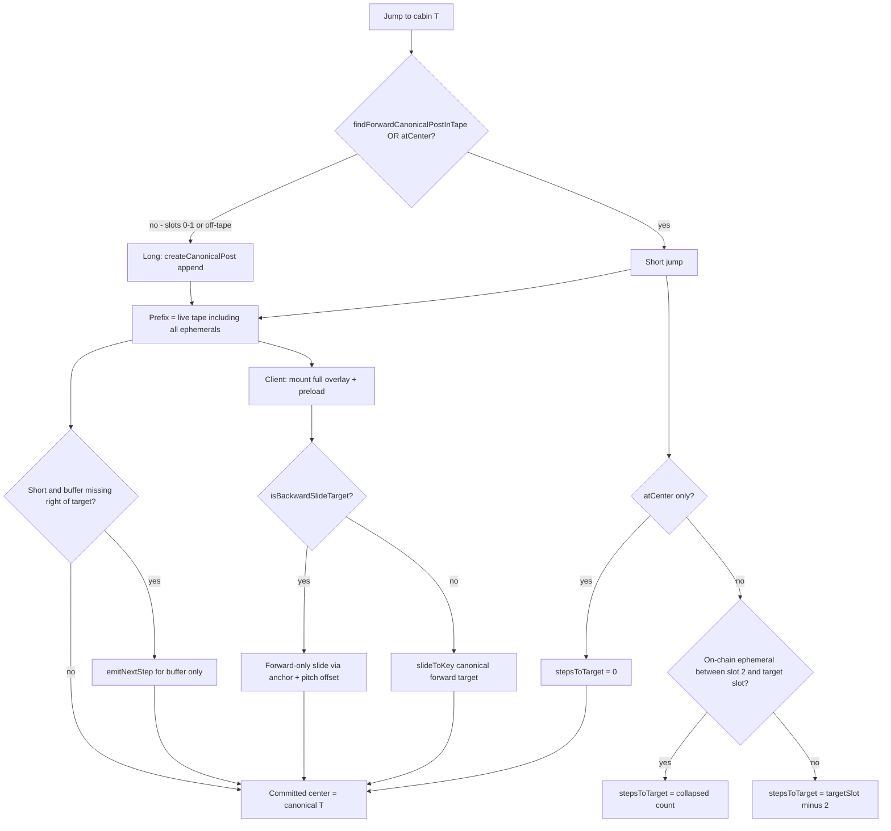

# Train cabin and jump system (authoritative spec)

**Status:** Behavioral contract for minimal append-only jump fix.  
**Code:** [`train_playback_controller.ts`](../../lib/train/train_playback_controller.ts), [`tape_helpers.ts`](../../lib/train/tape_helpers.ts), [`train_view.ts`](../../lib/train/train_view.ts), [`TrainDisplay.tsx`](../../islands/TrainDisplay.tsx).

**Constants** ([`train_view_constants.ts`](../../lib/train/train_view_constants.ts)):

| Constant | Value | Meaning |
|----------|-------|---------|
| `VIEWPORT_K` | 2 | Visible cabins each side of center |
| `LEFT_RENDER` | 2 | Slots kept left of center |
| `RIGHT_RENDER` | 4 | K visible + 2 preload right of center |
| `WINDOW_LENGTH` | 7 | Live tape length |
| `CENTER_SLOT` | 2 | **Center is always slot index 2** |

Cabin numbers `c1…cN` are **1-based** ring positions on approved submissions.

---

## 1. Normal playback (no jump)

### 1.1 Ring, tape, queue

- **Ring:** N approved submissions → cabins `c1…cN` (wraps).
- **Tape:** exactly 7 `TrainStep` objects, left → right; each has unique **`seq`** (DOM key `s{seq}`).
- **Queue:** FIFO of previews/QR **not yet on tape** (invisible until `emitNextStep` emits them).

### 1.2 Each dwell tick

1. `emitNextStep()` — queue first (preview ★ or QR), else next **sequential canonical** cabin.
2. Push at right edge; if length > 7, shift left.

**Example — N=10, canonical only:**

```
slot:    0    1    2    3    4    5    6
cabin:  c1   c2   c3   c4   c5   c6   c7
seq:    s1   s2   s3   s4   s5   s6   s7
                      ^
                   center (slot 2)
currentCabin = 3
```

Next tick → emit c8 (s8); window c2…c8; center c4; `currentCabin = 4`.

### 1.3 Ephemeral at center

If center slot holds ★/QR, `syncCurrentCabinFromCenter` **does not** update `currentCabin` (ephemeral ignored). Example: c10★ at center, `currentCabin` may still be 2.

---

## 2. Jump pipeline

1. **Server** `jump(T)`: `animationWindow`, committed `window` (7 slots), `stepsToTarget`.
2. **Client:** keep live prefix → extend overlay → slide `stepsToTarget` → commit `window`.

### 2.1 Append-only invariant

`animationWindow[0..6]` === live tape (same `seq` object references). **Never** remove on-chain ★/QR from prefix.

### 2.2 Short vs long classification

**Rule:** The train must **never** move backward. On-tape targets **left of center** (slots 0–1) are **long jumps**, not short.

| Branch | Detect |
|--------|--------|
| **Short** | `findForwardCanonicalPostInTape` returns slot **> 2** (canonical strictly forward of center), **or** canonical **at center** (slot 2) for no-op |
| **Long** | Otherwise — includes on-tape-left (slots 0–1), preview-only forward match, and not-on-tape targets |

```ts
const forwardSlot = findForwardCanonicalPostInTape(startTape, targetId);
const atCenter = isCanonicalAtCenter(startTape, targetId);
const isShortJump = forwardSlot !== null || atCenter;
```

**Do not** use `findRightmostCanonicalTargetIdx >= CENTER_SLOT` — that incorrectly treats left-of-center as short.

**At-center no-op:** when `atCenter && forwardSlot === null`, `stepsToTarget = 0` (no slide). **Controller** publishes a zero-step `jump` SSE (tape unchanged, no `scheduleNextTick` reset) so "Show on display" syncs the client even when already at that cabin.

**Root cause (server alone is insufficient):** Even when the server correctly classifies on-tape-left as long, the preserved overlay prefix keeps the target at slot 0/1. `getJumpSlideTargetKey` + `slideToKey` would center that left DOM node and **scroll backward**. Client must use forward-only slide semantics (§2.8).

### 2.3 Three append branches (no ring-walk)

| Branch | Append mechanism |
|--------|------------------|
| **Short** | Only **right-of-target preload** if missing — `emitNextStep()` for buffer **only** |
| **Long, on-tape-left** | Always append full `cabinsAroundTargetWithBuffer` (7 new canonical posts) at tail — **do not skip** because cabins exist in the live prefix |
| **Long + overlap** | `createCanonicalPost(n)` from overlap cut + missing collapsed-path visits |
| **Long, no overlap** | Full end-state block via `createCanonicalPost` |

**Never** loop `emitNextStep()` to walk every ring cabin toward target (current bug in `buildAppendOnlyJump`).

### 2.4 stepsToTarget (slide duration)

| Case | Rule |
|------|------|
| Short, no ★ on path slots (center+1 … target) | `targetSlot - CENTER_SLOT` |
| Short, ★ on that path | `computeJumpStepCount(from, to, N)` |
| Long | `computeJumpStepCount(from, to, N)` |

**Collapsed path (K=2):** head = from, from+1, from+2; tail = target−2, target−1, target; middle hidden when distance > 2K.

**Reference — c3→c9, N=10:** path `3,4,5,7,8,9` → **5** slides (c6 not a centering stop; may still be visible left).

### 2.5 End-state and overlap

End-state around target T: `c(T−2)…c(T+K+PRELOAD)` = 7 canonical cabins.

**Overlap:** longest suffix of **canonical** ids on live tape matching prefix of end-state list. ★/QR **ignored**.

**c3→c9 example (N=10):** live tail `[c7]`; end-state `[c7,c8,c9,c10,c1,c2,c3]`; overlap 1 → append **c8, c9, c10** only (ring wraps at N).

### 2.6 Implementation helpers

| Helper | Role |
|--------|------|
| `buildAppendOnlyJump` | Three-branch jump builder (short / long+overlap / long+no overlap) |
| `appendRightBufferOnly` | Short jump: `emitNextStep` for preload right of target only |
| `appendMissingPathVisits` | Long jump: `createCanonicalPost` for collapsed-path cabins not on tape |
| `appendEndStateTail` | Long jump: end-state tail from overlap cut via `createCanonicalPost` |
| `appendFullEndStateBlock` | On-tape-left long jump: append all 7 end-state cabins as new posts at tail |
| `buildCommittedWindow` | 7-slot committed tape centered on target (slice or neighborhood assembly) |
| `canonicalSuffixPrefixOverlap` | Overlap length for long-jump append trim |

Long jumps **never** call `emitNextStep` (queue untouched per J-E1). After commit, controller syncs `genIndex` to `wrap(targetCabin - 1 + RIGHT_RENDER)`.

### 2.7 Client: full overlay ready before animate

Before any jump slide starts, [`TrainDisplay.tsx`](../../islands/TrainDisplay.tsx) must:

1. `setJumpOverlaySteps(full animationWindow)` — mount the complete overlay chain
2. `waitForAllCabinRefs(overlayDomKeys(overlay))` — every `s{seq}` DOM node exists
3. `preloadCabinImages(imageUrlsFromWindow(overlay, canonical))` — all cabin images loaded
4. Measure slot pitch
5. **Then** run forward-only or short slide per §2.8

`animationWindow` is authoritative. Do **not** branch on partial `inChain` / collapsed preload subsets.

### 2.8 Client: forward-only slide

| Case | Animation |
|------|-----------|
| Short jump (canonical forward in overlay, slot > 2) | `slideToKey(getJumpSlideTargetKey(...))` — existing |
| Long jump **or** `isBackwardSlideTarget` (target at slot **< 2** in overlay) | **Forward-only:** `prepareJumpSlideOffset` + `jumpSlideStartTx` then `slideToKey(getForwardJumpSlideAnchorKey(...))` — never seek the left-positioned canonical node |
| `stepsToTarget === 0` | No slide; client fast-path skips overlay mount |

**Invariant:** DOM translate during jump never increases to reveal cabins further **left** of the pre-jump center.

| Helper | Role |
|--------|------|
| `findCanonicalTargetSlotInOverlay` | Rightmost canonical target slot in overlay |
| `isBackwardSlideTarget` | True when slide target would be **strictly left** of center (slot < 2) |
| `getForwardJumpSlideAnchorKey` | Forward DOM anchor for long / backward-target slides |
| `overlayDomKeys` | All `s{seq}` keys for overlay mount gate |
| `jumpSlideStartTx` / `prepareJumpSlideOffset` | Forward pitch offset before anchor slide ([`center_track.ts`](../../lib/train/center_track.ts)) |

### 2.9 Client: jump guards (concurrency)

| Guard | Behavior |
|-------|----------|
| Orchestrator busy | Incoming `jump` SSE is **deferred** (latest wins) until current advance/jump animation finishes — never `clearPending()` mid-flight |
| Deferred flush | Replaces queued jumps only (`pendingWithoutJumps`); **keeps** advances; orchestrator effect uses stable `useCallback` refs (never unstable deps) |
| `stepsToTarget === 0` | Skip overlay preload and slide compensation; `commitAdvance` only |
| Jump button | Disabled while `isSliding` on display controls |
| UI teardown | `finally` always restores `isSliding` / highlight even when effect cleanup cancels in-flight work |

`advance` events continue to enqueue during animation and drain in order after the current animation completes.

---

## 3. Jumps without ephemerals (J-N1–J-N4)

### J-N1 — Short, buffer sufficient

```
slot:    0    1    2    3    4    5    6
cabin:  c1   c2   c3   c4   c5   c6   c7
                      ^
currentCabin=3, jump c5 (canonical at slot 4)
```

| Field | Value |
|-------|-------|
| Branch | Short |
| stepsToTarget | 4 − 2 = **2** |
| Append | **None** (c6,c7 satisfy right-of-target buffer) |
| Overlay | Same 7 seqs |

### J-N2 — Short, append buffer only

```
slot:    0    1    2    3    4    5    6
cabin:  c1   c2   c3   c4   c5   c6   c7
                      ^
jump c4 (slot 3); need 4 slots right of target, only 3 present
```

| Field | Value |
|-------|-------|
| stepsToTarget | **1** |
| Append | **One** step via `emitNextStep()` (canonical c8 if queue empty) |

### J-N3 — Long with overlap (reference case)

Center c3, jump c9, N=10, live c1…c7.

| Field | Value |
|-------|-------|
| Collapsed path | 3,4,5,7,8,9 → stepsToTarget **5** |
| Append | Canonical c8, c9, c10 (overlap skips c7; ring wraps at N=10) |
| Overlay | s1…s7 + s8…s10 (10 total) |
| Slide centers | s3→s4→s5→s7→s8→s9 |
| Queue | Untouched |

### J-N4 — Long, no overlap

c1→c20, N=40, live c1…c7.

| Field | Value |
|-------|-------|
| Collapsed path | 1,2,3,18,19,20 → stepsToTarget **5** |
| Overlap | 0 → append full end-state c18…c24 |
| Overlay | live prefix + appended block |

### J-N5 — On-tape left of center (no backward motion)

```
slot:    0    1    2    3    4    5    6
cabin:  c3   c4   c5   c6   c7   c8   c9
               ^              ^
            target c4      center c5
currentCabin=5, jump c4 (canonical at slot 1)
```

| Field | Value |
|-------|-------|
| Branch | **Long** (`findForwardCanonicalPostInTape` null; slot 1 < center) |
| stepsToTarget | `computeJumpStepCount(5, 4, N)` — forward collapsed path (**5** for N=10) |
| Append | Full end-state block `[c2..c8]` appended at tail (7 new posts); queue unchanged |
| Overlay | live prefix (7) + appended tail (7) = 14 total |
| Client | `isBackwardSlideTarget` true → forward-only slide; **never** `slideToKey` to c4 at slot 0/1 |

**Reference — c15→c13, N=20:** center c15, target c13 at slot 0. Append tail `[c11..c17]` even though c13–c19 are already in the prefix.

---

## 4. Ephemeral model

```
┌─────────────┐     emitNextStep      ┌──────────────────────────┐
│ FIFO queue  │ ────────────────────► │ 7-slot tape (on-chain)   │
│ (not visible)│                       │ may include ★ or QR      │
└─────────────┘                       └──────────────────────────┘
```

| State | Visible? | Overlap? | Jump target? | On long jump |
|-------|----------|----------|--------------|--------------|
| Queued ★/QR | No | No | No | Queue **unchanged** |
| On-chain ★/QR | Yes | No | No (center = canonical) | **Never** removed from prefix |

| API | When |
|-----|------|
| `createCanonicalPost(n)` | Long jump; path/end-state append |
| `emitNextStep()` | **Only** short jump: preload right of target |

---

## 5. Jumps with ephemerals (J-E1–J-E12) — all corrected

### J-E1 — Queued ★ only; long jump

```
Queue:  c10★
slot:    0    1    2    3    4    5    6
cabin:  c1   c2   c3   c4   c5   c6   c7
                      ^
currentCabin=3, jump c9
```

| Field | Value |
|-------|-------|
| Branch | **Long** |
| Queue after jump | **Still c10★** — not drained |
| Overlay | s1…s7 + canonical c8…c10 — **no c10★** |
| Note | Canonical c10 in end-state ≠ queued preview c10★ |

### J-E2 — Queued ★ only; short jump buffer drain

```
Queue:  c10★
slot:    0    1    2    3    4    5    6
cabin:  c1   c2   c3   c4   c5   c6   c7
                      ^
jump c4 (slot 3); preload right of c4 insufficient
```

| Field | Value |
|-------|-------|
| Branch | Short |
| Append | `emitNextStep()` → **c10★ emitted** into overlay |
| stepsToTarget | 1 (no ★ between slots 2 and 3) |

**Only** case where queued-not-on-tape ★ enters overlay during jump.

### J-E3 — On-chain ★ off-path (right of target)

```
slot:    0    1    2    3    4    5    6
cabin:  c1   c2   c3   c4   c5  c10★  c7
                      ^
jump c5 (slot 4); ★ at slot 5
```

| Field | Value |
|-------|-------|
| Branch | Short |
| stepsToTarget | **2** (slot distance; ★ not between slots 2 and 4) |
| Prefix | ★ seq preserved |

### J-E4 — On-chain ★ on path

```
slot:    0    1    2    3    4    5    6
cabin:  c1   c2   c3  c10★  c4   c5   c6
                      ^
jump c4 (slot 4); ★ at slot 3
```

| Field | Value |
|-------|-------|
| Branch | Short |
| hasEphemeralOnPathToSlot | **true** |
| stepsToTarget | `computeJumpStepCount(from,4,N)` — **not** slot distance |
| Prefix | ★ preserved |

### J-E5 — ★ and canonical same submission

```
slot:    0    1    2    3    4    5    6
cabin:  c1   c2   c3   c4  c4★   c5   c6
                      ^
jump c4 — canonical at slot 3, c4★ at slot 4
```

| Field | Value |
|-------|-------|
| Branch | Short |
| Slide/committed center | **Canonical** c4 (slot 3), not c4★ |
| c4★ | Stays until natural scroll-off |

### J-E6 — Preview-only forward → long

```
slot:    0    1    2    3    4    5    6
cabin:  c1   c2   c3  c8★   c4   c5   c6
                      ^
jump c8 — only c8★ forward; no canonical c8
```

| Field | Value |
|-------|-------|
| Branch | **Long** |
| Append | New **canonical** c8 via `createCanonicalPost` |
| c8★ | Remains in prefix |

### J-E7 — ★ at center slot

```
slot:    0    1    2    3    4    5    6
cabin:  c1   c2  c10★  c4   c5   c6   c7
               ^
currentCabin=2 (NOT 10); jump c6
```

| Field | Value |
|-------|-------|
| Branch | Short (c6 at slot 5) |
| stepsToTarget | 3 |
| ★ | Not deleted; not committed center |

### J-E8 — ★ left of center

```
slot:    0    1    2    3    4    5    6
cabin: c10★  c2   c3   c4   c5   c6   c7
               ^
jump c6
```

| Field | Value |
|-------|-------|
| Prefix | ★ at slot 0 preserved through jump |
| Later | ★ scrolls off on normal advances |

### J-E9 — ★ does not satisfy overlap

```
On tape: … c7, c8★ (preview only)
End-state: c7, c8, c9, …
```

| Field | Value |
|-------|-------|
| Overlap | `[c7]` only — c8★ **ignored** |
| Append | Must still create **canonical c8** |

### J-E10 — On-chain ★ + queued ★; long jump

On-chain ★ anywhere in prefix (preserved). Queue has separate ★ (unchanged per J-E1). Append canonical tail only.

### J-E11 — QR (queued or on-chain)

Identical rules to ★ for prefix, queue, overlap, target. QR is never canonical.

### J-E12 — ★ survives commit

After jump commit, any ★ still in the 7 slots remains until normal `advance` shifts it off — **never** jump-deleted.

---

## 6. Decision flow



---

## 7. Ephemerals never

- Never committed jump center
- Never counted in overlap
- Never removed from prefix on jump
- Never cause ring-walk / sequential emit loop
- Queued-not-on-tape ★ never in overlay on **long** jump

---

## 8. Prior mistakes (do not repeat)

| Wrong | Correct |
|-------|---------|
| Center at slot 0 / c1 | Center always **slot 2**; c3→c9 starts at center c3 |
| `center_track_test` overlay fixture as jump spec | Layout math only; not behavioral spec |
| K=4 path in `train_view_test` golden | Production **K=2** |
| Long jump drains queue into overlay | **J-E1:** queue unchanged on long jump |
| Ring-walk via `emitNextStep` loop | Three-branch minimal append only |
| `slideToKey` to left-positioned canonical on long jump | Forward-only slide via `isBackwardSlideTarget` + anchor |
| Partial overlay preload before animate | Full `animationWindow` mounted + preloaded first (§2.7) |
| `findRightmostCanonicalTargetIdx >= CENTER_SLOT` for short | `findForwardCanonicalPostInTape` or `isCanonicalAtCenter` only |

---

## 9. Implementation checklist

- [x] Rewrite `buildAppendOnlyJump` (three branches, `fromCabin`, `createCanonicalPost`)
- [x] `jump()`: pass deps; sync `genIndex` after commit
- [x] Tests for J-N*, J-E*, no ring-walk regression
- [x] Mirror to `ground-up-wall-sdd/aidlc-docs/train_cabin_and_jump.md`; link from `audit.md`
- [x] No-backward rule: explicit short classification (`findForwardCanonicalPostInTape` + `isCanonicalAtCenter`); J-N5
- [x] Client overlay-ready gate (§2.7) and forward-only slide (§2.8)
- [x] Same-cabin no-op, backward detection fix, deferred jump while animating (§2.9)
