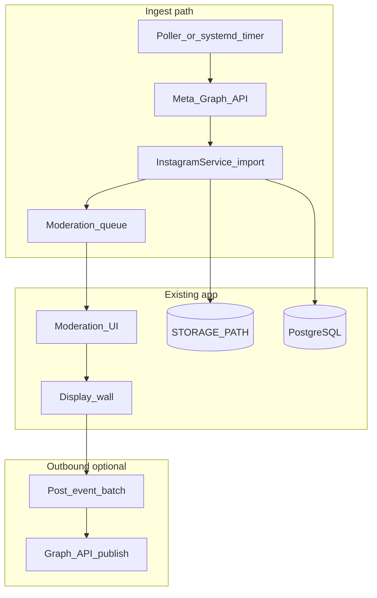

# Phase 03 — Instagram integration feasibility

**Status:** Research (2026-06-24)\
**Requirements:** FR-27–FR-31, NFR-20–21, R-05\
**Production stack:** Oracle VPS (same as Phase 01 — no Supabase)

This document evaluates **hashtag ingest** (written FRs) and **outbound posting** to the organiser’s
Instagram (stakeholder Q&A). Recommendation at the end.

---

## 1. Goals

| Stream          | Description                                                              | In FRs?                   |
| --------------- | ------------------------------------------------------------------------ | ------------------------- |
| **A. Ingest**   | Poll a configured hashtag; import public posts into the moderation queue | Yes (FR-27–30)            |
| **B. Outbound** | Post approved photowall content to the organiser’s IG after the event    | Stakeholder interest only |
| **C. Fallback** | Manual import if API path blocked or too slow                            | Implied by R-05           |

---

## 2. API landscape (2026)

### 2.1 What is dead or unsuitable

| API                             | Status                  | Why not for us                                                                   |
| ------------------------------- | ----------------------- | -------------------------------------------------------------------------------- |
| **Instagram Basic Display API** | Deprecated / restricted | No hashtag search; user-token only; not for aggregating third-party public posts |
| **Scraping / unofficial APIs**  | Against ToS             | Fragile, legal risk, no production use                                           |

### 2.2 Hashtag ingest — Instagram Graph API

**Requires:**

- Meta developer app with **Instagram** product
- Organiser **Instagram Business or Creator** account linked to a **Facebook Page**
- App Review approval for **`Instagram Public Content Access`** (Advanced Access)
- Permissions typically include `instagram_basic` plus Page-related scopes (`pages_read_engagement`,
  etc.)

**Flow:**

1. `GET /ig_hashtag_search?user_id={ig-user-id}&q={hashtag}` → hashtag node ID
2. `GET /{ig-hashtag-id}/recent_media?user_id={ig-user-id}&fields=...` or `/top_media`
3. Download image from `media_url` (public URL, time-limited) → store under `STORAGE_PATH`
4. Create submission with `source: "instagram"`, `source_metadata: { ig_media_id, permalink, ... }`

**Official docs:**

- [Hashtag Search](https://developers.facebook.com/docs/instagram-platform/instagram-api-with-facebook-login/hashtag-search/)
- [Recent Media](https://developers.facebook.com/docs/instagram-platform/instagram-graph-api/reference/ig-hashtag/recent-media/)
- [Top Media](https://developers.facebook.com/docs/instagram-platform/instagram-graph-api/reference/ig-hashtag/top-media/)

**Hard limits (product impact):**

| Limit                                                    | Implication                                                                                  |
| -------------------------------------------------------- | -------------------------------------------------------------------------------------------- |
| **30 unique hashtags per 7 days**                        | Fine for one event hashtag; avoid testing many tags                                          |
| **`recent_media` only returns posts from last 24 hours** | Must poll **at least every few hours** during the event window; missed window = missed posts |
| **No `username` on returned media**                      | Cannot auto-fill submitter name from API; use caption parse or show “Instagram” + permalink  |
| **Public media only; no Stories**                        | Stories with hashtag are invisible to API                                                    |
| **No boosted/promoted posts**                            | Paid reach excluded                                                                          |
| **~2 req/s per IG professional account**                 | Low-frequency polling is fine                                                                |
| **App Review + Business Verification**                   | **2–4+ weeks** typical; risky for a single fixed-date event if started late                  |

**Fit with existing schema:** `submissions.source` and `source_metadata` already exist
(`db/schema.sql`). Moderation source badge (FR-30) is a small UI addition.

### 2.3 Outbound posting — Instagram Graph API Content Publishing

**Requires:**

- Same Business/Creator account + Facebook Page link
- App Review for **`instagram_business_content_publish`** (and `instagram_business_basic`; older
  `instagram_content_publish` scopes deprecated Jan 2025)
- **Public HTTPS URL** for `image_url` when creating container — our VPS + Cloudflare can serve this
- Two-step publish: `POST /{ig-user-id}/media` → `POST /{ig-user-id}/media_publish`

**Official docs:**

- [Content Publishing](https://developers.facebook.com/docs/instagram-platform/content-publishing)

**Limits:**

| Limit                                       | Implication                                                         |
| ------------------------------------------- | ------------------------------------------------------------------- |
| **100 API-published posts per 24 h**        | Enough for post-event batch                                         |
| **Containers expire in 24 h**               | Batch job must publish same day                                     |
| **Image on public server**                  | Approved submission images must be reachable at a stable public URL |
| **Separate App Review** from hashtag access | Two review streams if both ingest + outbound                        |

**Tagging submitters:** `user_tags` on container may work for @mentions if we have handles; API does
not give us poster username from hashtag ingest anyway.

---

## 3. Architecture fit (Oracle VPS)

| Component                       | Proposal                                                                                                                     |
| ------------------------------- | ---------------------------------------------------------------------------------------------------------------------------- |
| `InstagramService`              | New interface: `configureHashtag`, `fetchAndImportNew`, optional `publishSubmission`                                         |
| `ContentSourceService` (NFR-21) | Thin wrapper; Instagram is first implementation                                                                              |
| Polling                         | In-process `setInterval` in `prod.ts` **or** `systemd` timer + `deno run scripts/ig_poll.ts` (preferred — isolates failures) |
| Config (FR-31)                  | `system_config` keys + secrets in `.env` (`META_APP_ID`, `META_APP_SECRET`, long-lived token)                                |
| Idempotency                     | Store `ig_media_id` in `source_metadata`; skip duplicates                                                                    |
| Failure isolation (NFR-20)      | Catch/log API errors; never block upload/moderation/display                                                                  |

**SSE / single instance:** Unchanged — VPS single process is correct for realtime.

---

## 4. Legal and product notes

- **Meta Platform Terms:** Storing and re-displaying imported media on a photowall likely requires
  permitted use under Public Content Access (campaign / audience understanding). Confirm wording
  with organiser.
- **FR-02a retention:** Participants already consent to organiser social use; Instagram-sourced
  content should use the **same** moderation + retention path.
- **PII:** Hashtag API does not return username; reduces accidental PII from API but caption may
  contain names/handles.
- **Manual fallback:** Aligns with Sharon’s “post on IG after the event” if API ingest fails —
  moderators export or screenshot approved items manually.

---

## 5. Fallback options (if App Review misses event date)

| Option                               | Effort | FR coverage                                   |
| ------------------------------------ | ------ | --------------------------------------------- |
| **Moderator “Import Instagram URL”** | Medium | Partial FR-28/29                              |
| **Admin CSV of permalinks**          | Low    | Partial                                       |
| **Manual upload only**               | None   | Status quo                                    |
| **Outbound-only** (no ingest)        | Medium | FR-27–30 not met; satisfies post-event social |

---

## 6. Timeline risk

| Milestone                               | Estimate                             |
| --------------------------------------- | ------------------------------------ |
| Meta app + Business account + Page link | 1–2 days                             |
| Development (ingest MVP)                | 3–5 days                             |
| App Review (Public Content Access)      | **2–4+ weeks** (not guaranteed)      |
| App Review (content publish)            | Additional **2–4 weeks** if separate |

**For a single National Day event:** Start Meta app setup **immediately** if ingest is desired on
event day. Otherwise plan **fallback-only** for event and ingest for a future event.

---

## 7. Recommendation

| Priority                        | Scope                                            | Rationale                                                                                                    |
| ------------------------------- | ------------------------------------------------ | ------------------------------------------------------------------------------------------------------------ |
| **P0 (event-safe)**             | Manual upload + moderation (current)             | Already works                                                                                                |
| **P1 (low risk, high value)**   | **Outbound posting** to organiser IG after event | Matches stakeholder “post after event”; one Business account; no hashtag App Review; uses our own media URLs |
| **P2 (if App Review succeeds)** | **Hashtag ingest** into moderation queue         | True FR-27–30; blocked by review timeline and 24h `recent_media` window                                      |
| **P2b (parallel)**              | **Manual import URL** tool                       | Insurance if review fails                                                                                    |

**Suggested Phase 3 split:**

- **Phase 3a:** Outbound publish + admin config + optional manual IG link import
- **Phase 3b:** Automated hashtag polling (after App Review approval)

---

## 8. Open questions for organiser

1. Is there an **Instagram Business** account + **Facebook Page** ready to link?
2. Is **automated hashtag ingest** required on event day, or is **post-event outbound posting**
   enough?
3. What is the **official event hashtag** (one tag — 30/7-day limit is not an issue)?
4. Who owns **Meta app review** screencasts and business verification paperwork?

---

## 9. Next implementation steps (after go/no-go)

1. Lock scope (3a vs 3b) with organiser
2. Create Meta app; document tokens in `.env.example`
3. Define `InstagramService` interface + fake for tests
4. Implement idempotent import → existing `PhotoWallService` create path
5. Moderation UI source badge
6. If outbound: public image URL helper + publish batch script

---

## References

- [requirements.md](../ai-dlc/inception/requirements/requirements.md) — Phase 3 FRs, R-05
- [services.md](../ai-dlc/inception/application-design/services.md) — `InstagramService` sketch
- [requirements.update01.context.md](https://github.com/ndparty/ground-up-wall-sdd/blob/main/updates/requirements.update01.context.md)
  — stakeholder IG Q&A (SDD repo)
